# ApexKit Dashboard Tour

Welcome to the ApexKit Admin Dashboard tour. This guide provides an overview of the features and capabilities available in the ApexKit management interface, serving as both a user-facing guide and a technical overview for developers.

## Table of Contents
1. [Login](#login)
2. [Main Dashboard](#main-dashboard)
3. [Multi-Tenancy & Sandboxes](#multi-tenancy--sandboxes)
4. [Data Management (Collections & Records)](#data-management)
5. [User & File Management](#user--file-management)
6. [Serverless Scripting & Templates](#serverless-scripting--templates)
7. [AI-Native Features (AI Actions & Vector Search)](#ai-native-features)
8. [System Logs & Settings](#system-logs--settings)

---

## 1. Login
The login page provides secure access to the administrative interface. Default credentials for a fresh installation are `admin@apexkit.io` / `password`.

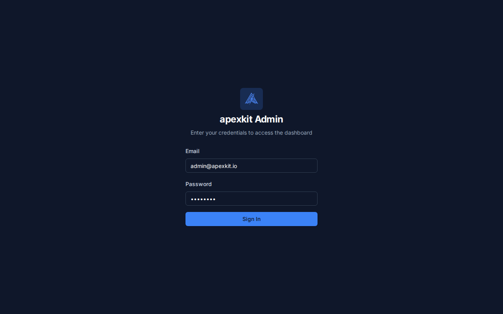

**Technical Note:** Authentication is handled via JWT. The dashboard communicates with the backend via the `/api/v1` routes.

---

## 2. Main Dashboard
The home screen provides a high-level overview of your ApexKit instance's health and activity.

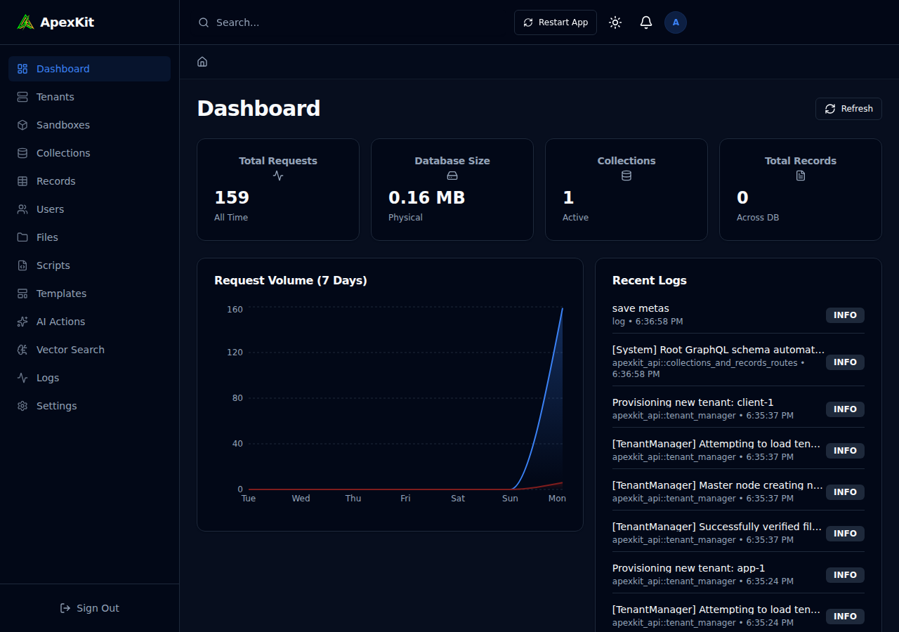

- **Key Metrics:** Monitor total requests, physical database size, active collections, and total records across all tenants.
- **Request Volume:** A 7-day visualization of traffic patterns.
- **Recent Logs:** Real-time feed of system events and background tasks.

---

## 3. Multi-Tenancy & Sandboxes
ApexKit is built from the ground up for multi-tenant applications.

### Tenants
Manage isolated environments for different clients or departments.

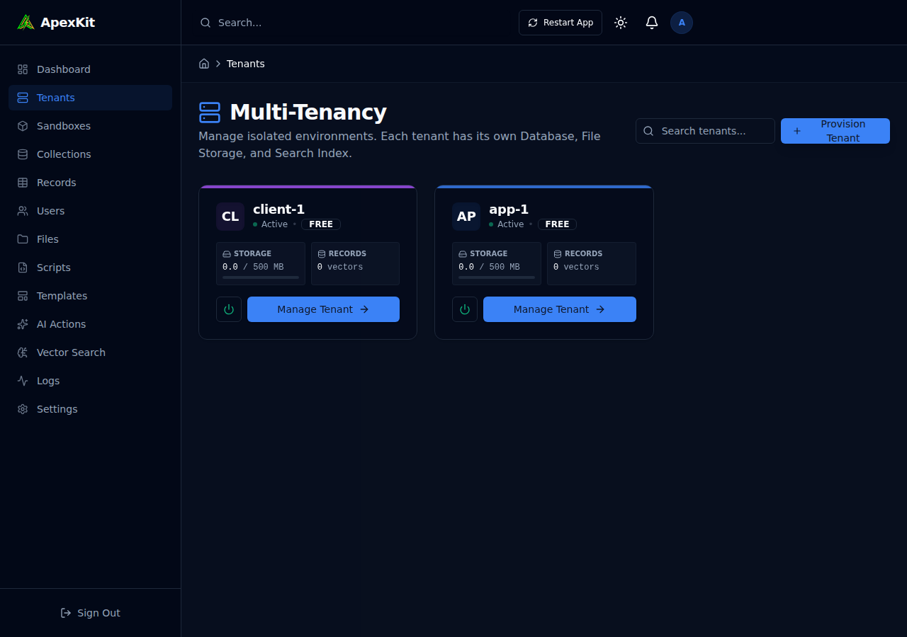

### Sandboxes
Sandboxes allow you to test schema changes or experiment with AI configurations without affecting production data.

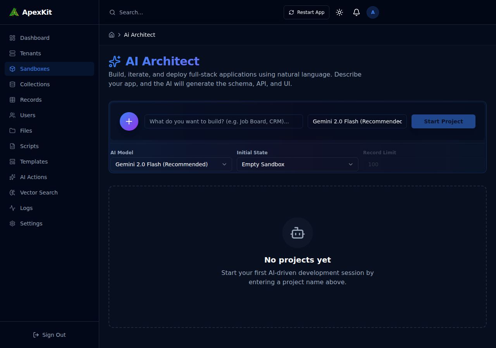

---

## 4. Data Management
ApexKit provides a powerful interface for defining data structures and managing content.

### Collections
Define your database schema using an intuitive interface. Collections support various field types, relations, and AI-ready configurations.

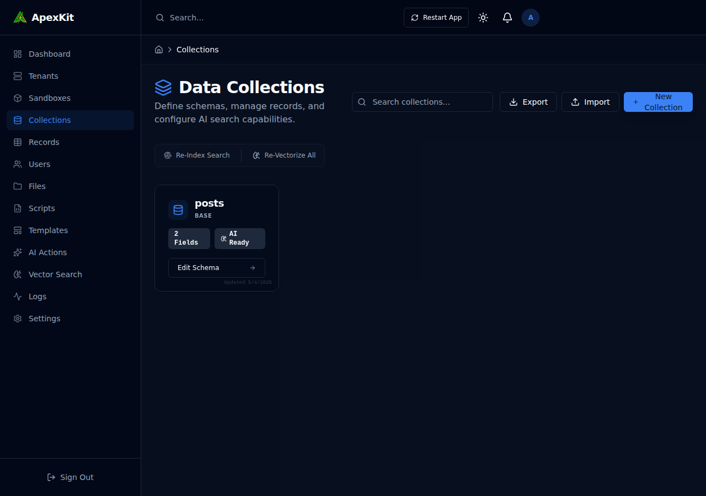

### Records
Directly manage the data within your collections. Features include filtering, searching, and bulk import/export.

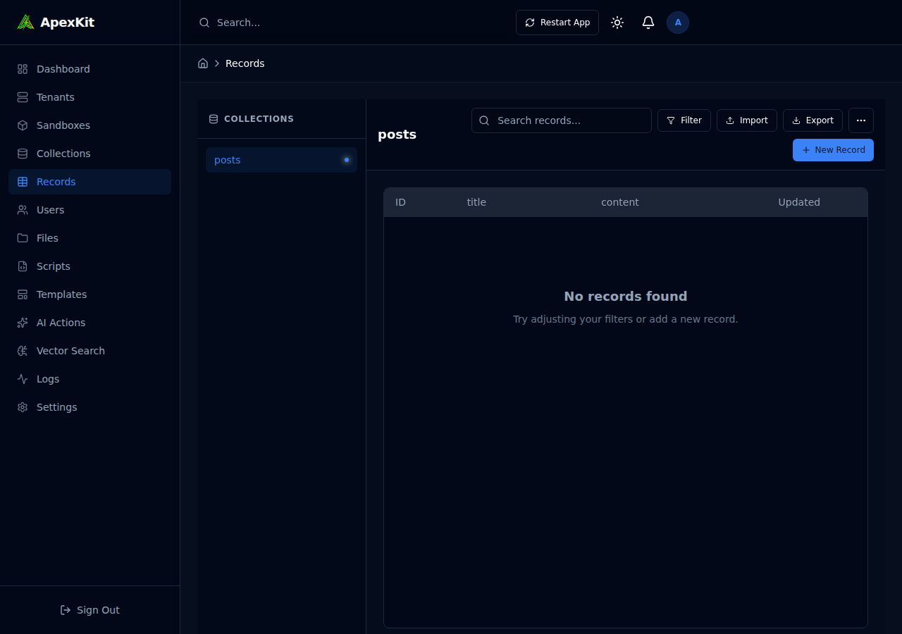

**Technical Note:** Every collection automatically generates REST and GraphQL endpoints.

---

## 5. User & File Management

### Users
Manage administrative users and application end-users. Control access through roles and permissions.

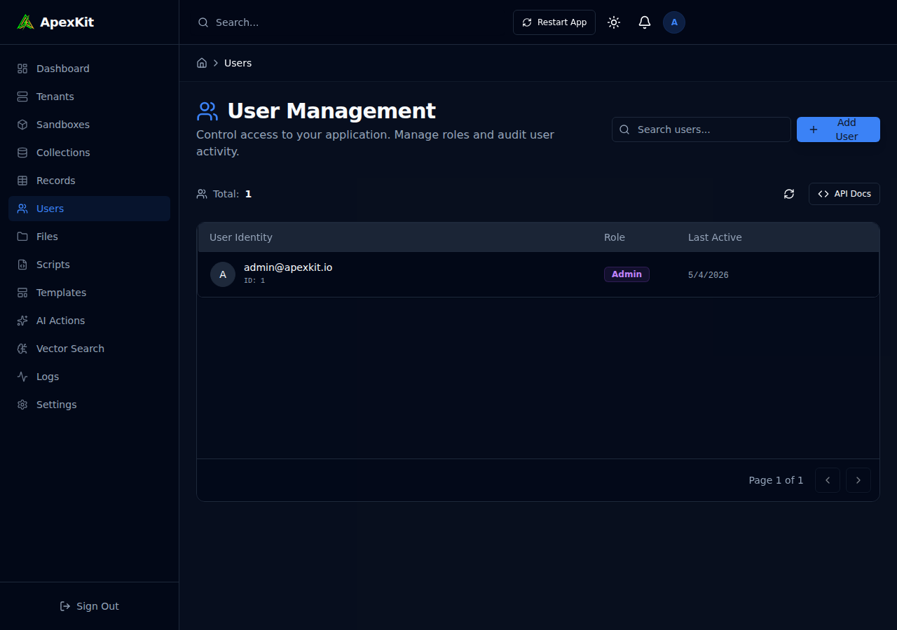

### Files
A built-in file manager for handling uploads. Supports local storage or S3-compatible providers.

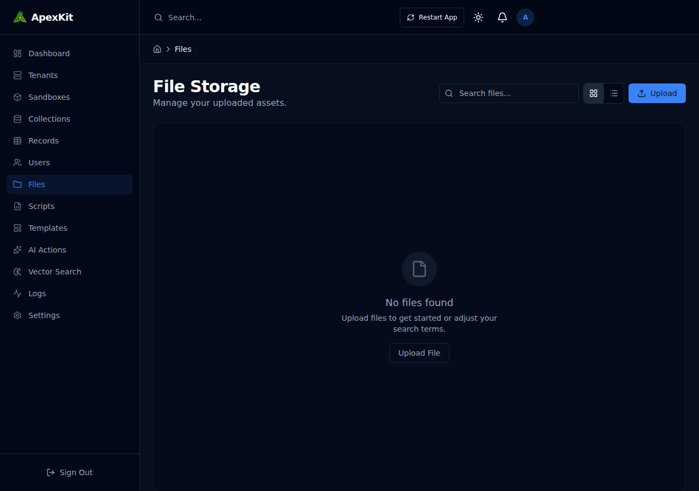

---

## 6. Serverless Scripting & Templates

### Scripts (Edge Functions)
Write custom logic in JavaScript that runs natively in the Rust backend using the `boa_engine`. Access `$db`, `$http`, and `$ai` global objects.

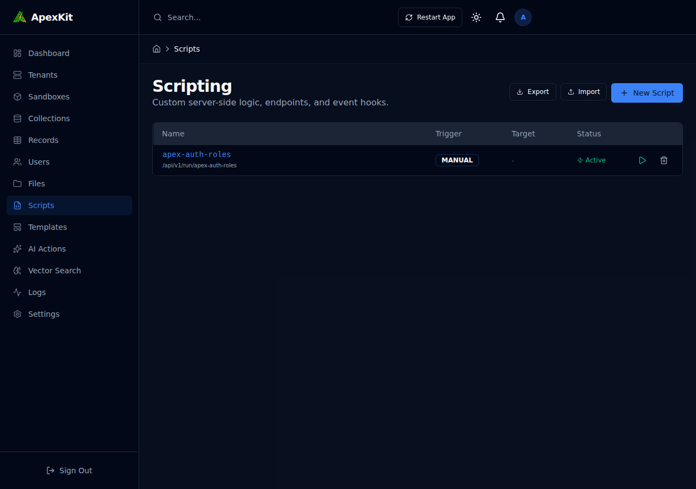

### Templates
Manage UI templates or email layouts directly from the dashboard.

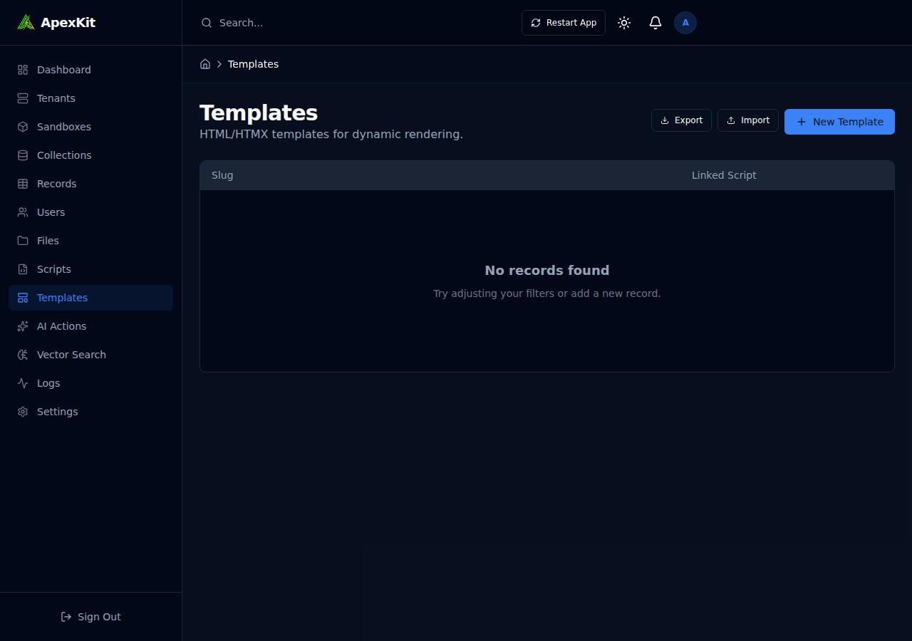

---

## 7. AI-Native Features
ApexKit differentiates itself with deeply integrated AI capabilities.

### AI Actions
Define secure, server-side LLM prompts that can be exposed as API endpoints. This allows you to integrate generative AI without exposing API keys to the frontend.

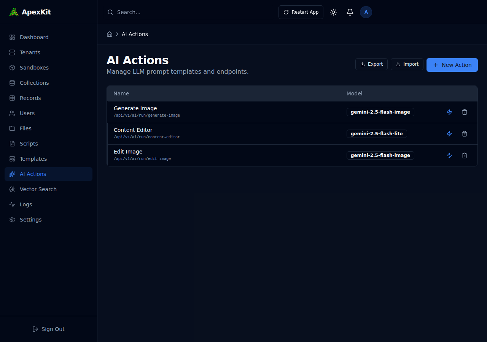

### Vector Search
Perform semantic searches on your data. ApexKit handles the embedding process automatically using local models (like `bge-small`) via the `candle` framework.

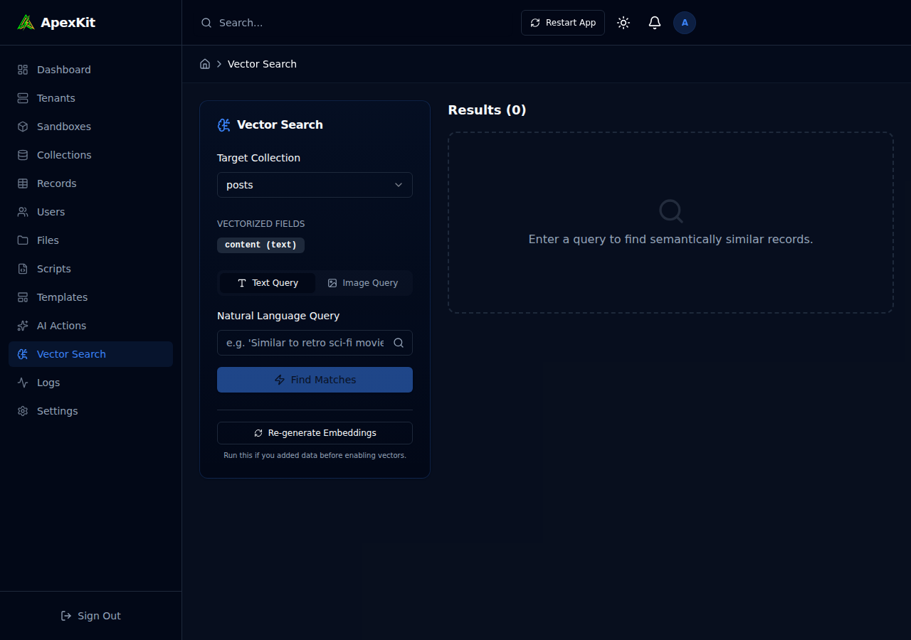

---

## 8. System Logs & Settings
Monitor system behavior and configure global parameters like SMTP settings, storage providers, and AI model configurations.

### Logs
A detailed trace of all operations, including AI inference, database queries, and system events.

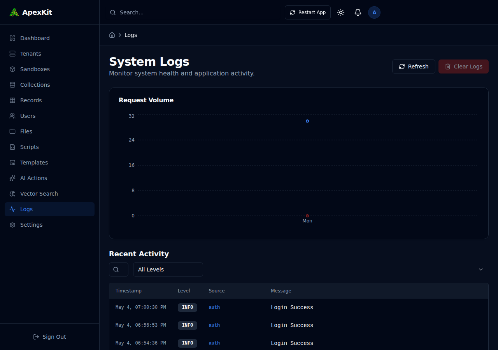

### Settings
Centralized configuration for the entire ApexKit ecosystem.

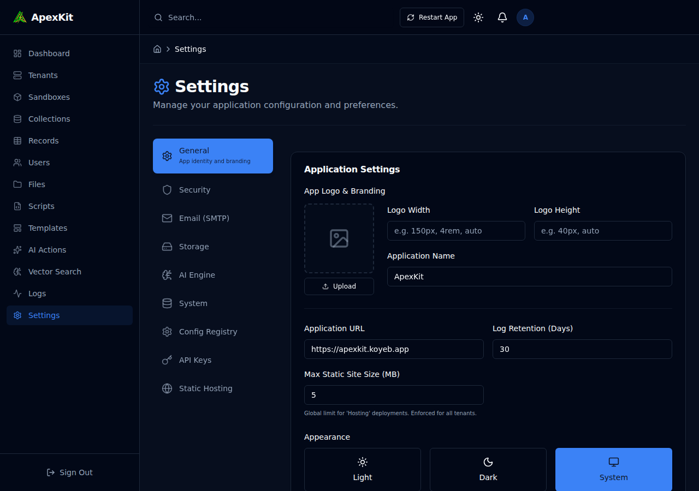

---

*This documentation was automatically generated to provide a snapshot of the ApexKit dashboard capabilities.*
