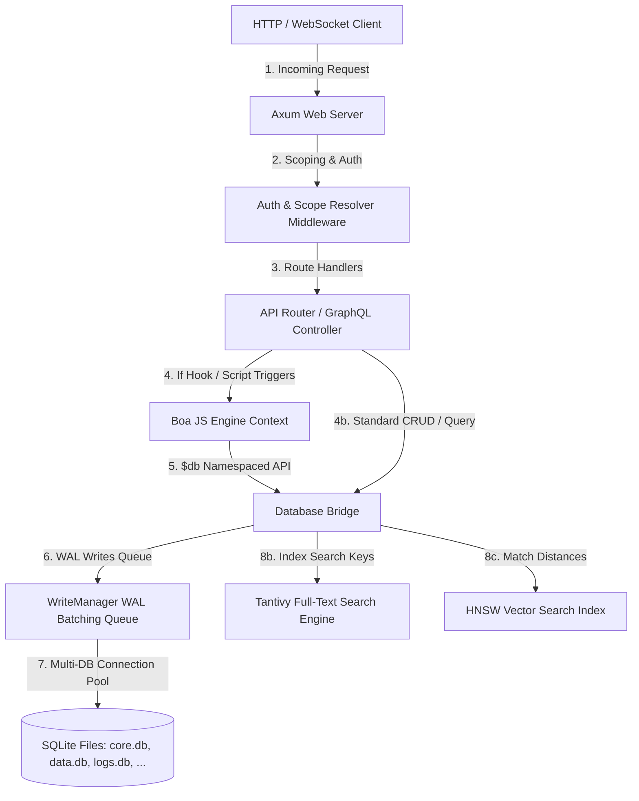
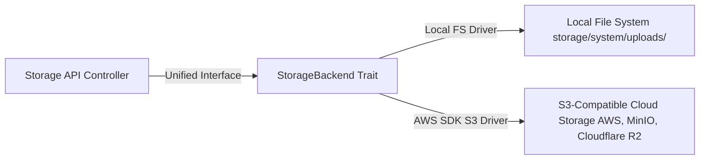
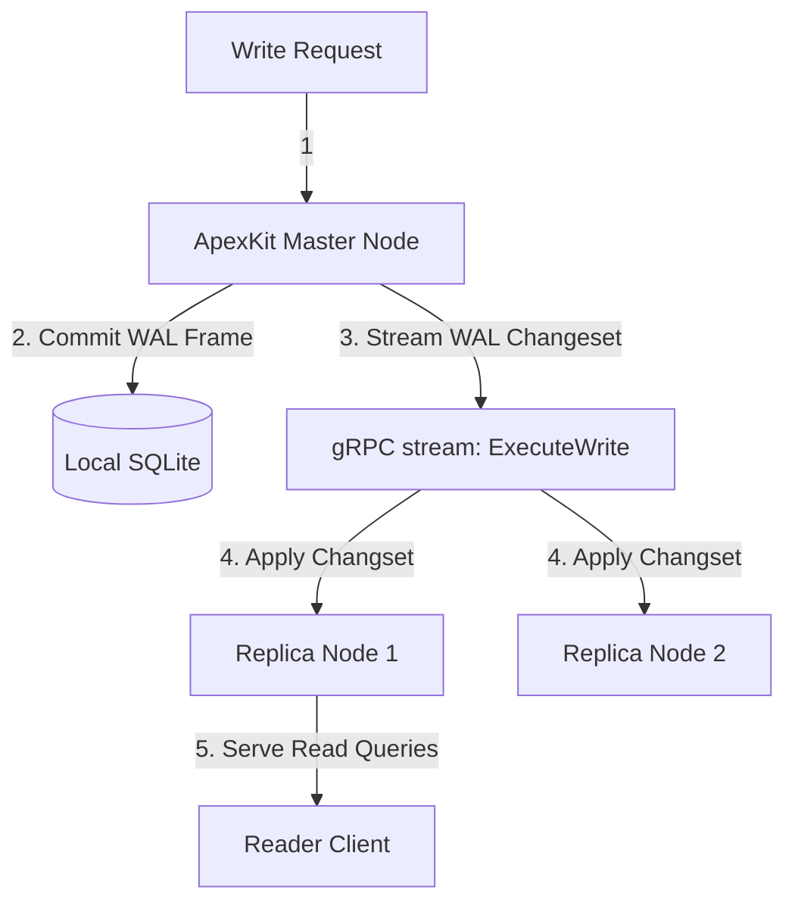

# ApexKit Advanced Architecture, Internals, and Performance Optimization

This guide is a deep dive into the engineering, architecture, and internals of ApexKit. It is designed for platform engineers and advanced developers seeking to optimize, extend, and deploy ApexKit at enterprise scale.

---

## 1. System Architecture & Request Flow

ApexKit is compiled as a unified, highly optimized Rust binary containing an embedded Axum HTTP/gRPC server, a Rust-native JS execution context (Boa), a full-text indexing engine (Tantivy), and concurrent SQLite connection pools.

### Flowchart: Internal Request Flow



### Request Processing Lifecycle:
1. **Axum Ingress**: The client connects via HTTP/WebSocket/SSE to the Axum engine.
2. **Scope Resolution**: The Scoping Middleware decodes the Authorization Bearer JWT. It extracts the `scope` claim (e.g. `tenant:client_alpha` or `sandbox:session_123`) and maps the request's connection paths and environment keys strictly to `/storage/tenants/client_alpha/` or `/storage/sandboxes/session_123/`.
3. **Interception (Boa Runtime)**: If database triggers or endpoint hooks are registered (e.g. `before_user_create`), Axum boots a lightweight, sandboxed `Boa` execution context.
4. **Storage Orchestration**: Operations are marshaled to the unified `Db` traits, multiplexing writes into WAL batching queues (`WriteManager`) and routing read queries to open connection pools.

---

## 2. Dynamic Storage Abstraction: Local vs. S3

ApexKit decouples file metadata from physical file storage, providing a unified storage manager capable of switching or migrating backends transparently.



### Storage Backends:
- **Local Filesystem Backend**: Saves uploaded files directly to scoped folders on disk (e.g., `storage/system/uploads/{filename}`). It handles instant thumbnail generation via the `image` and `webp` crates, caching output files in an in-memory `thumb_cache` (Moka).
- **S3-Compatible Backend**: Hooks directly into AWS S3, Cloudflare R2, MinIO, or DigitalOcean Spaces. It automatically signs download URLs (`getFileUrl(filename, { signed: true, expiresIn: 3600 })`) and executes upload streams directly.
- **Online Migration**: Admins can migrate live storage directories between Local FS and S3 using the `/admin/storage/migrate` API endpoint without losing metadata references.

---

## 3. The Boa JavaScript Engine (Scripting Runtime)

Server-side scripts and event triggers in ApexKit are executed by **Boa**, an embeddable, Rust-native JavaScript engine.

### Architectural Benefits over V8:
- **Absolute Memory Safety**: Because Boa is written in 100% Rust, it is immune to V8-level memory vulnerabilities, buffer overflows, and pointer corruption.
- **Super-fast Cold Starts**: Boa contexts spin up in sub-microseconds without the huge memory/warmup overhead of Node.js or V8 isolates.
- **In-Process Thread Scheduling**: Scripts run directly on Axum's Tokio worker threads, avoiding inter-process communication (IPC) context-switching overhead.

### Engine Limitations & Workarounds:
- **Single-Threaded Context Execution**: Within a single script invocation, code runs sequentially. Long-running or infinite loops (`while(true)`) can block that specific thread. ApexKit safeguards this by running script executions inside a monitored Tokio blocking pool with timeouts.
- **No Node.js Native Modules**: Standard NPM packages using C++ extensions or Node-specific built-ins (like `fs` or `net`) will not run. Developers must use pure ES Modules (ES6).
- **Namespaced Database Access**: Scripts access databases strictly via the namespaced `$db` API (e.g., `$db.records.create`, `$db.records.list`). This is intercepted by Rust bindings and executed with tenant-level scoping.

---

## 4. Tantivy Search Engine Tuning & Optimization

Full-text search in ApexKit is driven by **Tantivy**, a high-performance, Lucene-like search engine written in Rust.

### Index Compilation & Compaction:
- **Segment Compaction**: When documents are inserted, Tantivy creates small "segments" on disk. To maintain low-latency query results, Tantivy periodically merges these segments into larger ones. You can manually force complete index compaction and segment pruning by invoking the `/admin/collections/{id}/reindex` endpoint.
- **Memory Tuning**: Tantivy utilizes a memory index buffer for write operations. In high-concurrency write environments, increase the indexing buffer limit in your `.env` config file:
  ```env
  TANTIVY_INDEXING_BUDGET_MB=64
  ```

---

## 5. SQLite Write WAL Batching & Concurrency

SQLite traditionally allows multiple simultaneous readers, but blocks them during a write operation. ApexKit overcomes this limitation using two advanced techniques:

### 1. Write-Ahead Logging (WAL) Mode
By enforcing `PRAGMA journal_mode = WAL` and `PRAGMA synchronous = NORMAL`, readers can continue accessing the database without being blocked while a write is committed.

### 2. WriteManager Batching Queue
To maximize write throughput and eliminate database locking contention, all write operations (`INSERT`, `UPDATE`, `DELETE`) are processed through ApexKit's `WriteManager` channel batcher. Writes are queued, scheduled, and committed sequentially through dedicated write threads, allowing hundreds of concurrent clients to submit changes without ever hitting a `SQLITE_BUSY` lock.

---

## 6. Master-Replica gRPC Replication

For horizontal scaling, ApexKit supports a low-latency, real-time Master-Replica replication model utilizing high-performance gRPC channels.



### Key Replication Dynamics:
- **gRPC Snapshots**: Replicas download raw SQLite database snapshots directly from the Master over gRPC during startup.
- **Changeset Streaming**: The Master hooks into SQLite's WAL session changesets, streaming incremental binary differences over gRPC connections in real-time.
- **Write Forwarding**: Replicas act as read-only caches. If a Replica receives a write request, it automatically forwards it via gRPC to the Master, which commits the write and streams the resulting changesets back to all Replicas.
- **Configuration**:
  - **Master**: Run with an `APEXKIT_MASTER_KEY` environment secret.
  - **Replica**: Point to the Master endpoint using `APEX_MASTER_URL=http://<master_ip>:<port>` and authenticate with the matching `APEXKIT_MASTER_KEY`.
