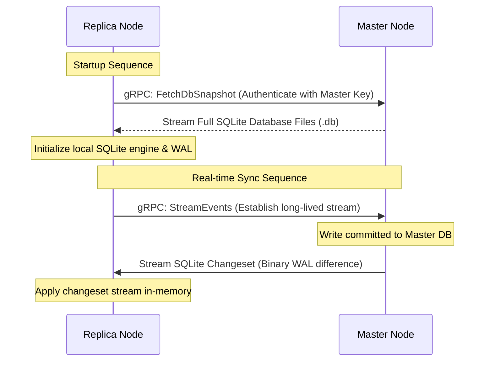

# gRPC Master-Replica Replication in ApexKit

ApexKit supports an advanced, low-latency, real-time **Master-Replica replication engine** running over secure gRPC channels. This architecture allows you to scale read operations horizontally across multiple geographically distributed nodes while maintaining a single, consistent source of truth for write operations.

---

## 1. How Replication Works

ApexKit replication does not rely on heavy distributed database consensus engines. Instead, it operates directly on the SQLite physical filesystem layer using a combination of **Full Database Snapshots** and **Session Changeset Streams**.



### The Synchronization Steps:

1. **Bootstrap (Snapshot Sync)**: When a Replica boots up, it initiates a connection to the Master and downloads the absolute raw `.db` files (for core, data, configurations, system, and vectors).
2. **Streaming Synchronization (gRPC changesets)**: Once the Replica's databases are matched, the Replica opens a long-lived gRPC `StreamEvents` connection. Whenever a write is committed on the Master, ApexKit extracts the database changes using SQLite's binary session changesets and streams the binary frames directly to all connected Replicas. Replicas apply these changesets instantly to keep their database state identical to the Master.
3. **Write Forwarding**: Replicas are read-only. If a Replica receives a write request (e.g. `POST /api/v1/collections`), it intercepts the request, forwards the SQL transaction payload to the Master via a gRPC `ExecuteWrite` call, waits for the Master to commit, and returns the Master's response to the client. The write then streams back down to all Replicas through the changeset stream.

---

## 2. Setting Up Replication

To configure replication, you must configure two global environment variables:
- `APEXKIT_MASTER_KEY`: A shared base64-encoded secret key used to secure and authenticate the gRPC channels between nodes.
- `APEX_MASTER_URL`: The URL of the Master Node (e.g., `http://10.0.0.5:5000`). If this variable is defined, the ApexKit instance automatically runs in **Replica Mode**. If it is empty or undefined, it runs in **Master Mode**.

### Step 1: Boot the Master Node

On the Master server, run ApexKit with a generated master key:

```bash
export APEXKIT_MASTER_KEY="your_base64_encoded_32_byte_secret_key"
./apexkit --port 5000
```

### Step 2: Boot one or more Replica Nodes

On each Replica server, point the `APEX_MASTER_URL` to the Master's IP and port, and provide the identical `APEXKIT_MASTER_KEY`:

```bash
export APEXKIT_MASTER_KEY="your_base64_encoded_32_byte_secret_key"
export APEX_MASTER_URL="http://master-ip:5000"
./apexkit --port 5000
```

---

## 3. Data Consistency & Performance

### Eventually Consistent Reads, Strongly Consistent Writes
- **Writes are strongly consistent**: Write transactions are committed directly on the Master's database. Because of this, write conflicts are non-existent, and standard SQL concurrency guarantees apply.
- **Reads are eventually consistent**: Replicas serve read requests (`GET` endpoints and GraphQL queries) using their local SQLite snapshots. Changes made on the Master typically propagate to Replicas within milliseconds, making it ideal for high-scale applications where read latency must be sub-millisecond.

### Failure Recovery & Reconnections
If a Replica loses connection to the Master, it will continuously attempt to reconnect over gRPC. Upon reconnection, ApexKit automatically compares database transaction indexes, catching up on any missed WAL changesets, or triggers a full database snapshot refresh if the divergence is too wide.
