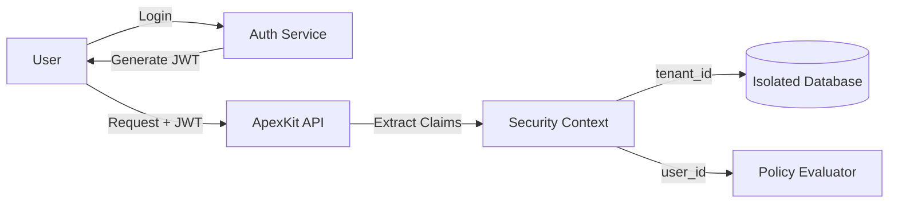

# Authentication & Security Policies

ApexKit implements a robust, multi-tenant authentication system coupled with a flexible Attribute-Based Access Control (ABAC) engine for security policies.

## Authentication Layers

### 1. Root Authentication
Used for system-wide administration (creating tenants, managing global settings).
- **Identifier:** `root`
- **Key:** Defined by `APEXKIT_ROOT_KEY` environment variable.
- **Scope:** Access to all tenants and system databases.

### 2. Tenant/Sandbox Authentication
Used for application-level users.
- **Identifier:** `tenant` / `sandbox`
- **Mechanism:** JWT (JSON Web Tokens).
- **Context:** Each token contains the `tenant_id`, `user_id`, and `role`.

## JWT Scoping

When a user logs in, ApexKit issues a JWT. This token is required for all subsequent requests to protected resources.



**Standard Claims:**
- `sub`: User ID
- `tid`: Tenant ID
- `role`: user / admin
- `exp`: Expiration time

## Security Policies (ABAC)

Security policies are defined at the collection level. They determine who can `read`, `create`, `update`, or `delete` records.

### Policy Evaluation Logic

Policies are strings that are parsed and evaluated against the security context and the record data.

| Rule Type | Example | Logic |
| :--- | :--- | :--- |
| **Public** | `public` | No check, anyone can access. |
| **Authenticated** | `auth` | Must have a valid JWT. |
| **Role-based** | `admin` | JWT `role` must be 'admin'. |
| **Owner-based** | `owner:author` | The `author` field in the record must match the `sub` (User ID) in the JWT. |
| **Advanced** | `auth.id == field:creator` | Custom expression matching JWT claims against record fields. |

### Evaluation Process

```mermaid
flowchart TD
    Req[Incoming Request] --> PolicyCheck{Policy Type?}
    PolicyCheck -- "public" --> Allow[Allow Access]
    PolicyCheck -- "auth/admin" --> JWTCheck{Valid JWT?}
    JWTCheck -- No --> Deny[401 Unauthorized]
    JWTCheck -- Yes --> RoleCheck{Role Matches?}
    RoleCheck -- No --> Deny
    RoleCheck -- Yes --> Allow

    PolicyCheck -- "owner:field" --> DataCheck{Record[field] == JWT.sub?}
    DataCheck -- Yes --> Allow
    DataCheck -- No --> Deny[403 Forbidden]
```

## Policy Expressions

ApexKit supports complex expressions for fine-grained control:

- `auth.role == 'manager' || owner:creator`: Allows managers or the creator of the record.
- `field:status == 'published' || admin`: Allows anyone to read 'published' records, but admins can read anything.

## Security in Scripting

The `$db` tool in the scripting engine is **context-aware**. When a script runs in the context of a tenant request, `$db` automatically applies the current tenant's isolation and enforces policies unless explicitly overridden (e.g., using a Root-level script).

```javascript
// This will only return records belonging to the current tenant
// and will honor the 'read' policy of the collection.
const records = await $db.records.list('posts');
```
