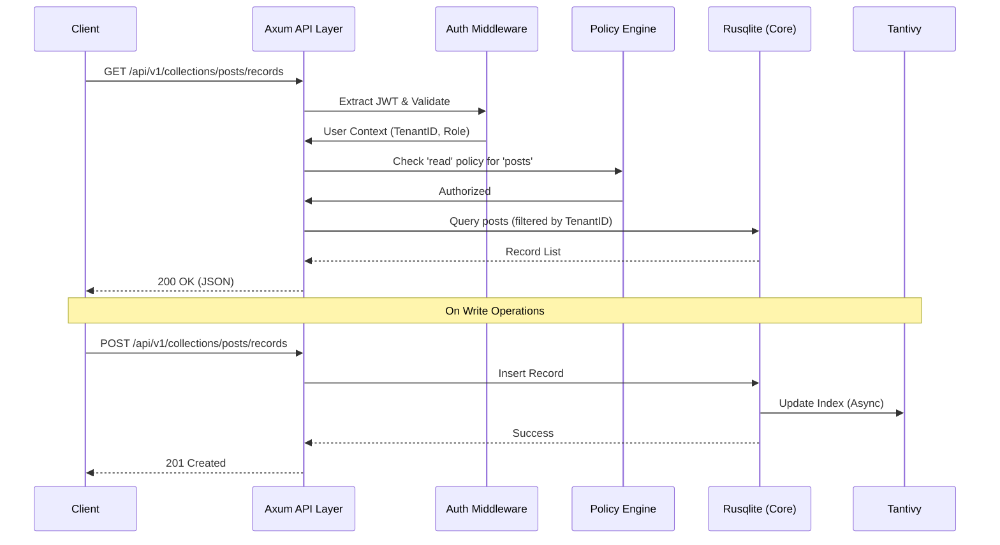
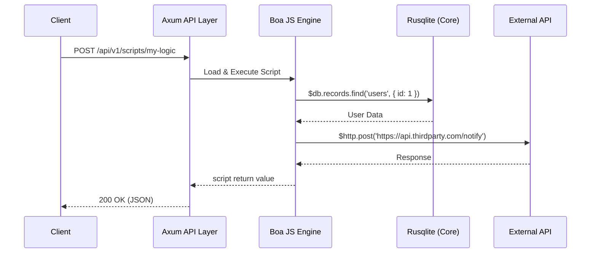
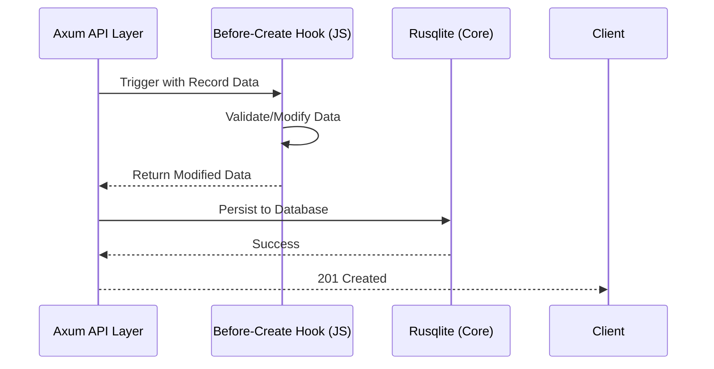

# Request Data Flow

This document describes the lifecycle of a request in ApexKit, from the client's HTTP call to the final response.

## Standard API Request Flow

For standard operations like fetching records or creating a collection, the flow is optimized for direct database interaction.

## Scripted Request Flow

When a request hits a custom endpoint or a hook, ApexKit spins up a sandboxed JavaScript environment.

## Hook Execution Flow

Hooks allow you to inject logic before or after standard database operations.

## Internal Transaction Handling

ApexKit ensures data integrity by wrapping multiple operations in transactions, even when they involve the search index.

1. **Transaction Start:** A SQLite transaction is opened.
2. **Database Change:** Data is written to the JSONB columns.
3. **Index Notification:** The Search Engine is notified of the change.
4. **Transaction Commit:** If everything succeeds, the transaction is committed.
5. **Real-time Broadcast:** After commit, the change is broadcasted via WebSockets/SSE.
