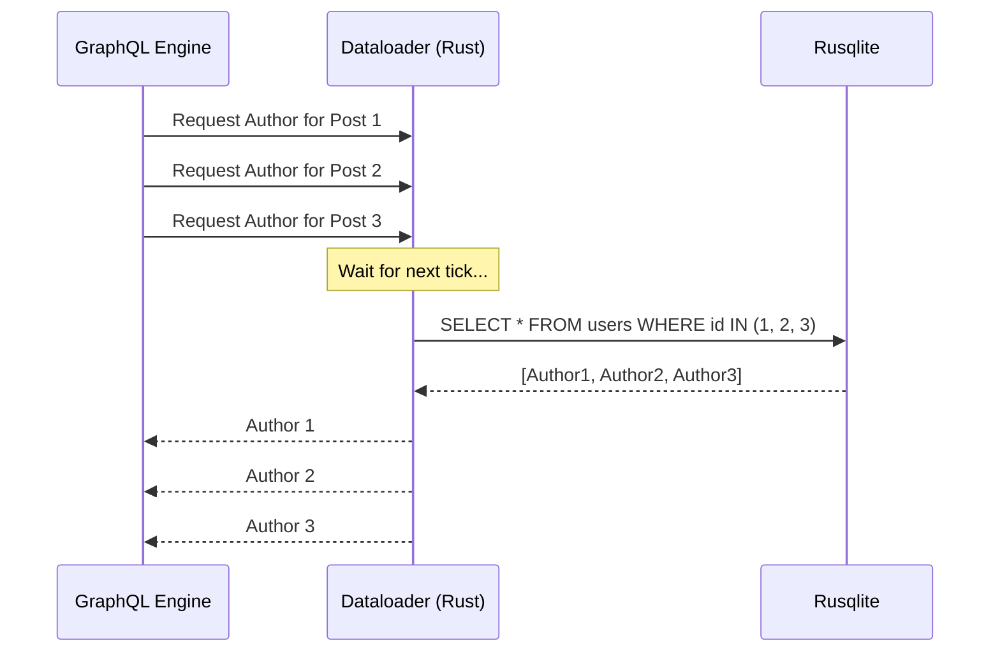

# GraphQL Deep Dive & Examples

ApexKit's GraphQL engine is designed to be both automatic and highly extensible. This document provides advanced examples and patterns for getting the most out of the GraphQL API.

## Automatic Schema Generation

For every collection, ApexKit generates a rich set of Queries and Mutations.

### Example: Complex Filtering & Sorting

```graphql
query GetTopProducts {
  # Fetch 'products' collection
  products(
    limit: 5,
    sort: "-price", # Sort by price descending
    where: {
      status: "active",
      stock: { "$gt": 0 },
      category: { "$in": ["electronics", "gadgets"] }
    }
  ) {
    total
    items {
      id
      name
      price
      category
      # Automatic expansion of 'manufacturer' relation
      manufacturer_id {
        name
        country
      }
    }
  }
}
```

## Custom Scripted Resolvers

Custom resolvers allow you to add business logic that doesn't fit into standard CRUD.

### Example: User Dashboard Aggregation

This resolver combines data from multiple collections into a single optimized response.

**Script (`scripts/userDashboard.js`):**
```javascript
export const graphql = {
  "parent": "Query",
  "name": "userDashboard",
  "args": { "userId": "ID!" },
  "returnType": "JSON"
};

export default async function(req) {
  const { userId } = await req.json();

  // Fetch multiple datasets in parallel
  const [user, recentOrders, stats] = await Promise.all([
    $db.records.get('users', userId),
    $db.records.list('orders', {
        filter: { customer_id: userId },
        limit: 5,
        sort: '-created_at'
    }),
    $db.query(null, {
        from: 'orders',
        select: [{ fn: 'sum', field: 'total', as: 'lifetimeValue' }],
        where: { customer_id: userId }
    })
  ]);

  return new Response({
    profile: user,
    recentOrders: recentOrders,
    stats: stats[0]
  });
}
```

**GraphQL Query:**
```graphql
query GetDashboard {
  userDashboard(userId: "u_12345")
}
```

### Example: Attaching Computed Fields to Types

You can add fields to existing types, such as calculating a "reading time" for a blog post.

**Script (`scripts/postReadingTime.js`):**
```javascript
export const graphql = {
  "parent": "posts", // Target the 'posts' collection type
  "name": "readingTime",
  "returnType": "Int"
};

export default async function(req) {
  const { parent } = await req.json();
  const wordsPerMinute = 200;
  const wordCount = parent.content.split(/\s+/g).length;
  const minutes = Math.ceil(wordCount / wordsPerMinute);

  return new Response(minutes);
}
```

**GraphQL Query:**
```graphql
query {
  posts {
    items {
      title
      content
      readingTime # This is now available on every post
    }
  }
}
```

## The Dataloader Advantage

Standard GraphQL implementations often suffer from the "N+1" problem. ApexKit's engine uses Rust-based dataloaders to batch requests automatically.



This ensures that even deeply nested queries remain performant.
