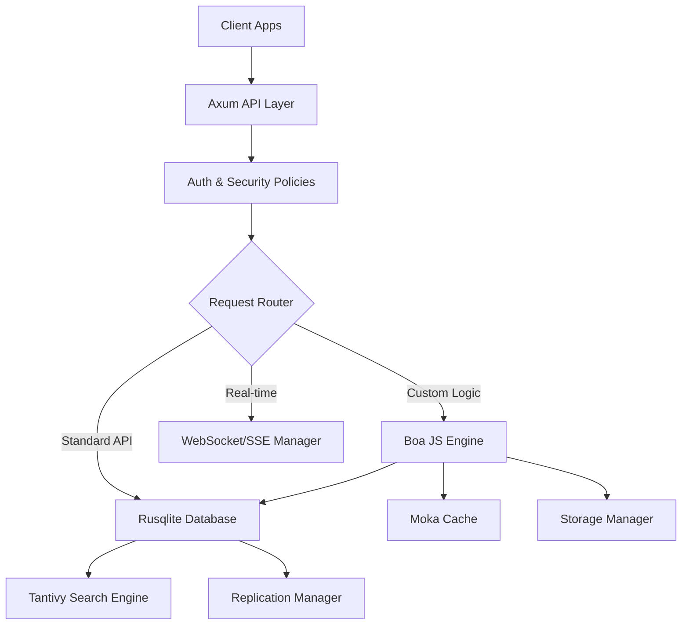

# Architecture Overview

ApexKit is a modern, high-performance Backend-as-a-Service (BaaS) delivered as a single binary. It is designed to be extremely fast, easy to deploy, and highly extensible via server-side JavaScript.

## Single-Binary Philosophy

Unlike traditional backend stacks that require a separate database server, an API server, a cache, and a background worker, ApexKit bundles everything into one process.

- **Embedded Database:** Uses SQLite (via Rusqlite) for primary storage, meaning no external database setup is required.
- **Embedded Search:** Uses Tantivy for full-text and vector search, integrated directly into the database lifecycle.
- **Embedded Scripting:** Uses the Boa engine to execute JavaScript logic without needing Node.js or V8.
- **Embedded Real-time:** Built-in WebSocket and SSE support for live data updates.

This approach dramatically simplifies deployment, reduces latency between components, and lowers operational overhead.

## Multi-Tenancy & Sandboxing

ApexKit is built from the ground up for multi-tenancy. It supports two primary types of isolation:

1. **Sandboxes:** Logical partitions within the system. Each sandbox has its own collections, records, scripts, and configuration.
2. **Tenants:** A higher-level abstraction, often representing a single customer or organization, which can contain multiple sandboxes.

Data is isolated at the database level, ensuring that one tenant cannot access another's data.

## System Components

## Module Organization

The project is organized into a Rust workspace with three main crates:

- **`apexkit-api`**: The entry point. It contains the Axum web server, CLI, and high-level route handlers.
- **`apexkit-core`**: The heart of the system. Contains the business logic, database abstractions, scripting engine integration, and storage drivers.
- **`apex-vector`**: A specialized crate for handling vector embeddings and similarity search.
