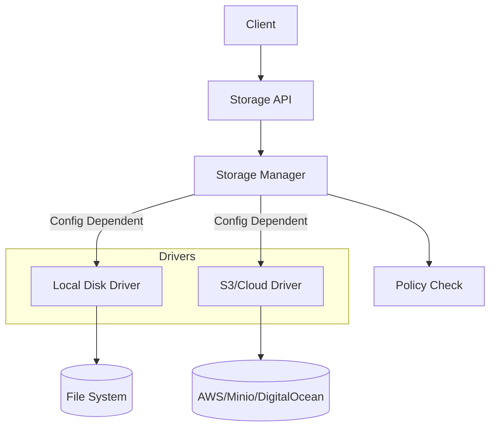

# File Storage & Processing

ApexKit provides a unified abstraction for file storage, allowing you to switch between local disk and cloud storage (S3) without changing your code.

## Storage Architecture

The Storage Manager handles file uploads, retrieval, and on-the-fly image processing.



## Storage Drivers

### Local Disk
- **Path:** Files are stored in the `storage/` directory relative to the binary.
- **Organization:** `storage/tenants/{tenant_id}/uploads/{filename}`.
- **Best for:** Development and single-node deployments.

### S3 Compatible
- **Supported Providers:** AWS S3, Minio, Digital Ocean Spaces, R2, etc.
- **Configuration:** Set via environment variables or the Admin UI.
- **Best for:** Production, high availability, and multi-node setups.

## Image Processing (On-the-fly)

ApexKit includes a built-in image processor that can generate thumbnails and resize images dynamically.

**Requesting a Thumbnail:**
`GET /api/v1/storage/file/my-image.jpg?thumb=200x200`

- **Caching:** Processed images are cached in `storage/cache` to ensure subsequent requests are lightning fast.
- **Format Conversion:** Supports common formats like JPG, PNG, and WebP.

## Security & Policies

Files are treated as first-class citizens in the security model.

1. **Private by Default:** Files uploaded to a tenant are only accessible via that tenant's API.
2. **Access Control:** You can define policies on the `files` collection to restrict who can upload or view specific files.
3. **Signed URLs:** For S3 storage, ApexKit can generate temporary signed URLs for secure client-side access.

## Scripting Integration ($storage)

You can manage files directly from your JavaScript logic.

```javascript
export default async function(req) {
    // 1. Fetch a file from a URL
    const image = await $http.get('https://example.com/logo.png');

    // 2. Save it to ApexKit storage
    const fileId = await $storage.upload('logo.png', image, {
        collection: 'assets',
        is_public: true
    });

    // 3. Store the reference in a record
    await $db.records.create('settings', {
        logo_id: fileId
    });

    return new Response({ success: true, fileId });
}
```

## Internal Cleanup

When a record containing a file reference is deleted, ApexKit does **not** automatically delete the physical file (to prevent accidental data loss). You can implement a `before-delete` hook to handle file cleanup if desired.
